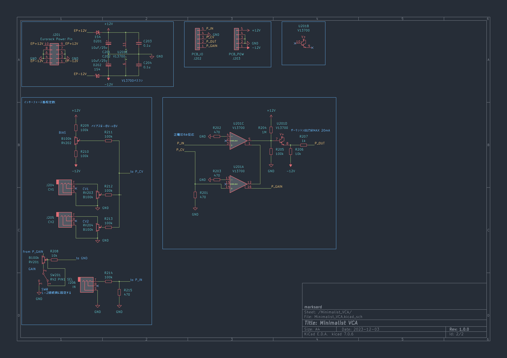

# Minimalist VCA

Eurorack 4HP simple voltage control amplifier using V13700

## Specification

### Power

|Use Voltage|Current consumption|
|:--|:--|
|+12V|3mA|
|-12V|3mA|

### Input

|Name|Description|
|:--|:--|
|IN||
|CV1||
|CV2||

### Output

|Name|Description|
|:--|:--|
|OUT||

### Controller

|Name|Description|
|:--|:--|
|Bias|CV offset about 0V at 12o'clock position|
|Gain|Adjustment for distortion depending on CV input|
|CV1|CV1 Modulation Depth|
|CV2|CV2 Modulation Depth|

## Image

## Schematic

## Demonstration
